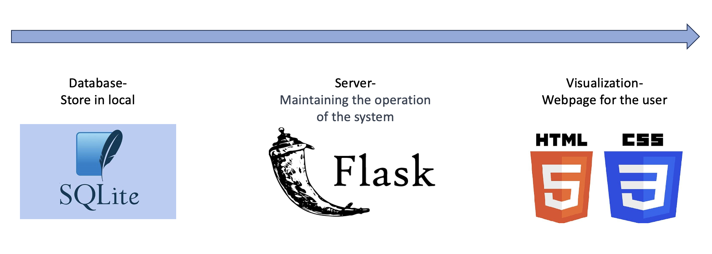

# NBA Lottery Website

This repository is about NBA playoff gambling system in 2023

## Project Overview
* Utilized Python Flask as the backend server
* All of the data is stored in database SQLite, connecting and operating by python library 'sqlite3'
* Use HTML, CSS to design the website



## Different Functionality in the website 
* Search the information of games(series/single matches)
* Register the membership
* Deposit money to the account
* The information of gambling
* Bet on the match

## Quick Start
Open the "NBA_gambling_website" file and start the service by executing command in "app.py"


```python app.py```

## Web Pages

After input the URL in the browser

### First Page


### Game information

**series**

**single matches**


### Team/Player information

**Team**


**Player**


### Bet information


### Login page


### Deposit/Withdraw money


### Betting


### Member information


